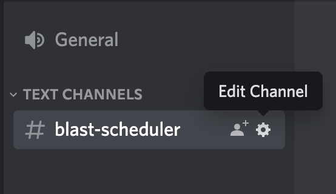
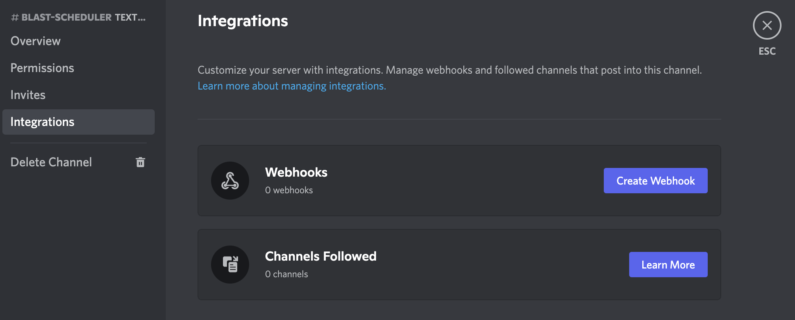
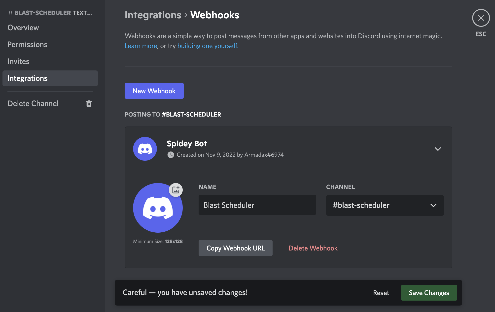

# Discord Notifications
Blast Scheduler can send notifications to your Discord channel. You need to provide a Discord Web Hook and use given id as your `connection` parameter.

## How to get a Discord Web Hook

1. Click `Edit Channel` on a text channel in your discord server which you want to use as the notification channel.
   

2. Go to `Integrations` tab and click `Create Webhook`.

3. Click `New Webhook`. Save changes then click `Copy Webhook URL`.

